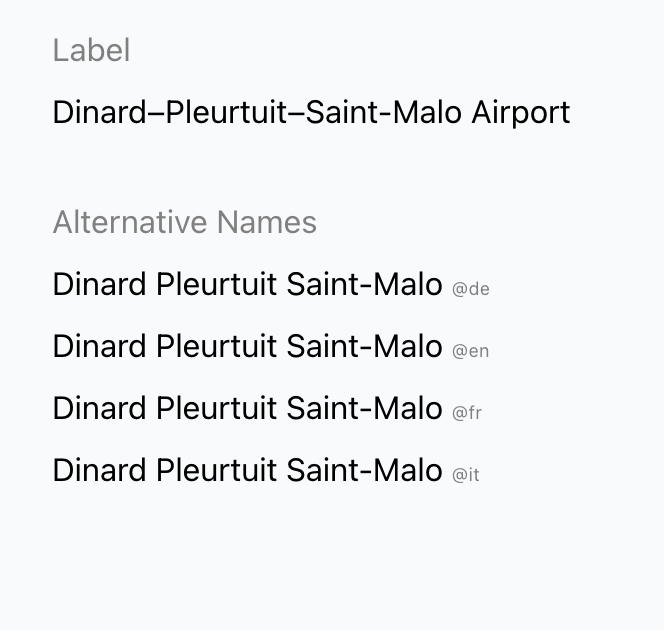

# How literals are shown in Blueprint

All literal values are shown. You have the possibility to influnce how they are shown in the Blueprint.



## Literal Label
The light gray text 'Label' is the label of the literal.

Bluprint tries to find a good label for the literal. It is based the following rules and order of precedence:

1. TBox: If the predicate has a
    - has skos:prefLabel use it
    - has rdfs:label use it

2. Break the predicate IRI into parts and "un camelCase" it
    - String after last #
    - String after last /

3. If none of the above works, use the IRI as label


You can override the labe by using a LiteralDisplayRule. 

## Literal Display Rule

A Literal Display Rule is a rule that defines how a literal is shown in the Blueprint.

There are currently not many option to influence the display of literals. You can set a label and you can set the order. 

Technically Blueprint is using a Syntetic Literal Display Rule if no configuration is given. 

The interface for a Literal Display Rule is:

```typescript
export interface LiteralDisplayRule {
    readonly iri: string,     // because it's RDF
    readonly label: string,   // the label show in the UI
    readonly renderLiteralAs: LiteralRenderType, // give a hint how to render the literal
    readonly order: number,   // the order in which the literal is shown in the UI
    readonly path: RdfTypes.NamedNode,   // the predicate to follow (not a list). 
    readonly targetClass: RdfTypes.NamedNode[], // the rule applies to all classes given here
}
```

You have to wirte a rule in RDF and upload it to the triple store. A rules looks like this:


```turtle
@prefix vorlon: <https://vorlon.described.at/ontology#> .
@prefix blueprintMetaShapes: <https://ld.flux.zazuko.com/shapes/metadata/> .
@prefix rdfs: <http://www.w3.org/2000/01/rdf-schema#> .
@prefix sh: <http://www.w3.org/ns/shacl#> .
@prefix blueprint: <https://flux.described.at/> .
@prefix : <http://localhost:7001/> .


# don't show this property for airports 
:Airport-P2795 a blueprint:LiteralDisplayRule ;
    rdfs:label "Directions" ;
    sh:path <http://www.wikidata.org/prop/direct/P2795> ;
    sh:order 0 ;
    blueprint:showAs blueprintMetaShapes:Hidden ;
    sh:targetClass vorlon:Airport
.

:Airport-shortName a blueprint:LiteralDisplayRule ; 
    rdfs:label "Alternative Names" ;
    sh:path <https://vorlon.described.at/ontology#shortName> ;
    sh:order 2;
    blueprint:showAs blueprintMetaShapes:Plain ;
    sh:targetClass vorlon:Airport
.
	
```

- The first rule is hidding the property P2795 (directions) for airports.
- The second rule is showing the shortName property as a plain text with the label "Alternative Names" for all airports.


You cannot have multiple Literal Display Rules for the same predicate and class.

## Literal Display Rule

### rdfs:label
The label of the literal. This is the text that is shown in the UI.
### sh:path
The path to the literal. This is the predicate that is used to get the literal value. This is a NamedNode. No lists are allowed.
### sh:order
The order in which the literal is shown in the UI. This is a number. The lower the number, the higher the priority.
Synthetic Literal Display Rules have an order of 10. 
### blueprint:showAs
The type of the literal. This is a NamedNode. The following values are allowed:

- `https://flux.described.at/blueprintMetaShapes#Plain` - show the literal as plain text
- `https://flux.described.at/blueprintMetaShapes#Hidden` - hide the literal

There are no more options at the moment.
### sh:targetClass
The class to which the rule applies. You can have multiple classes.