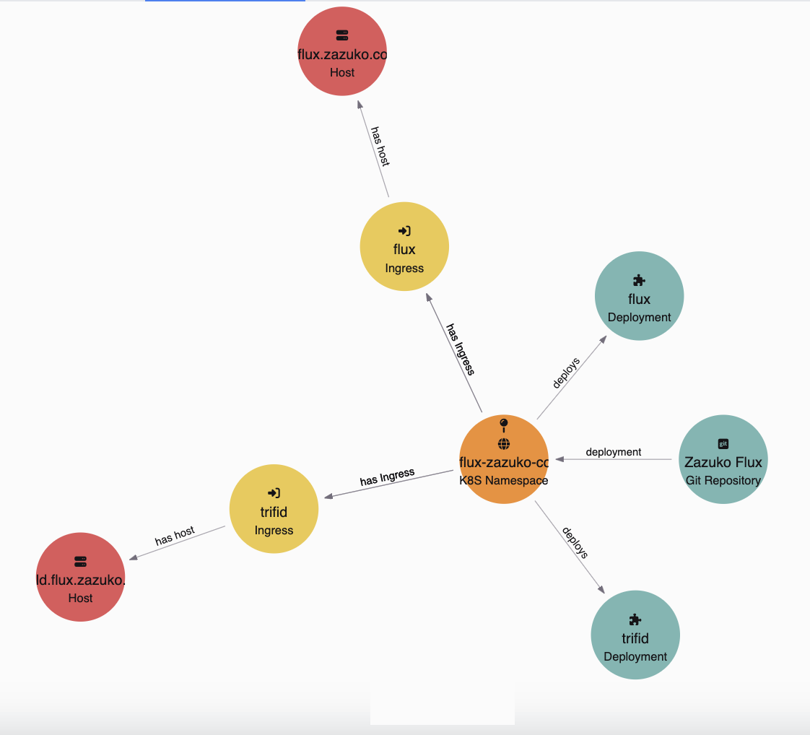
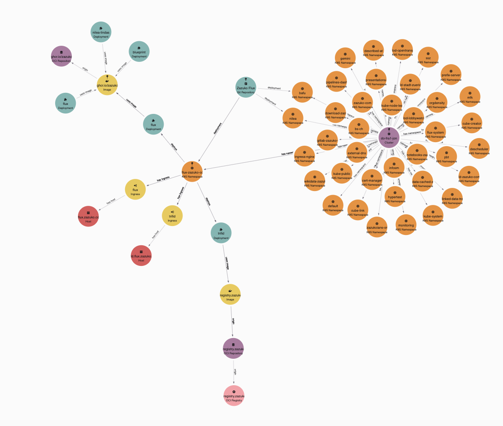
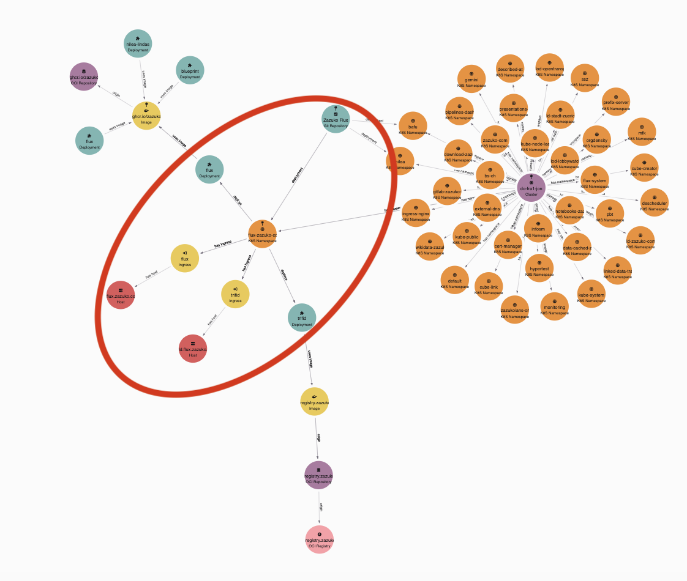
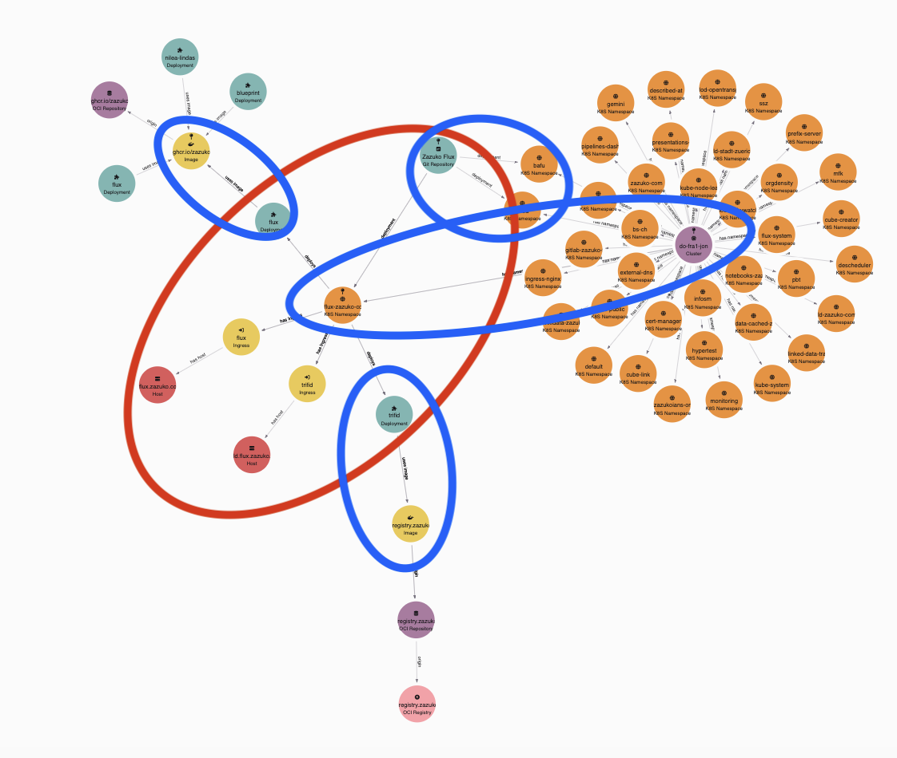
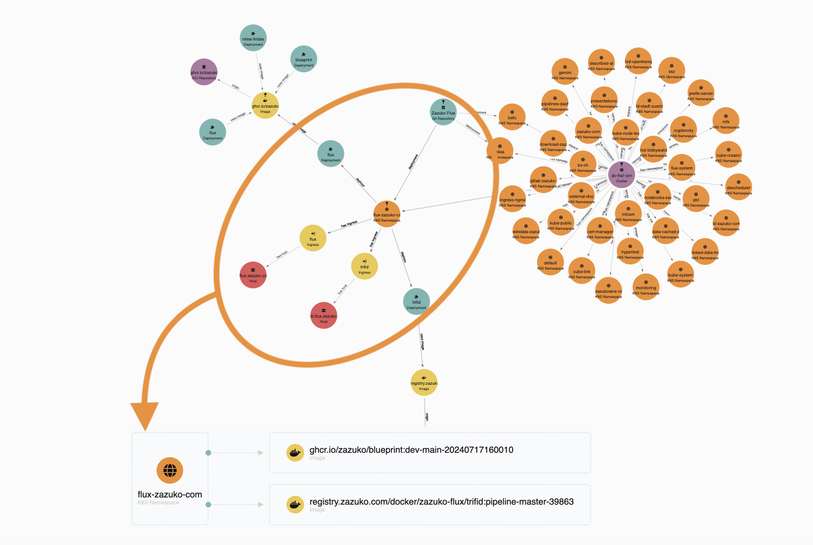
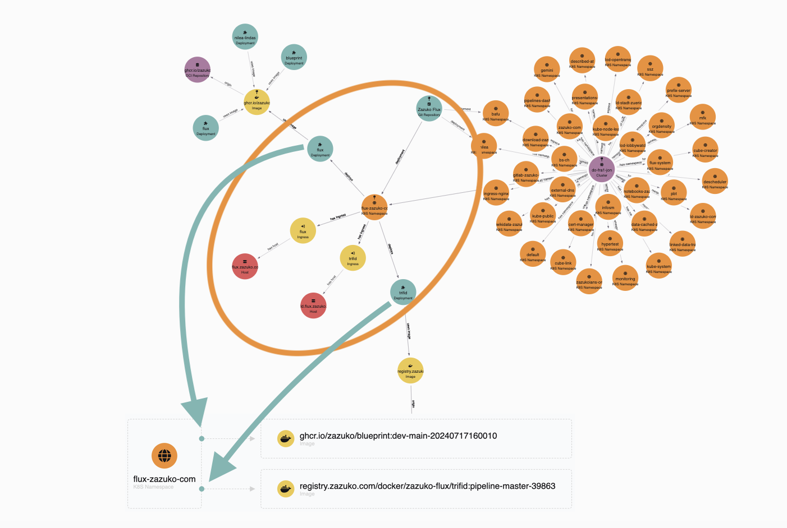
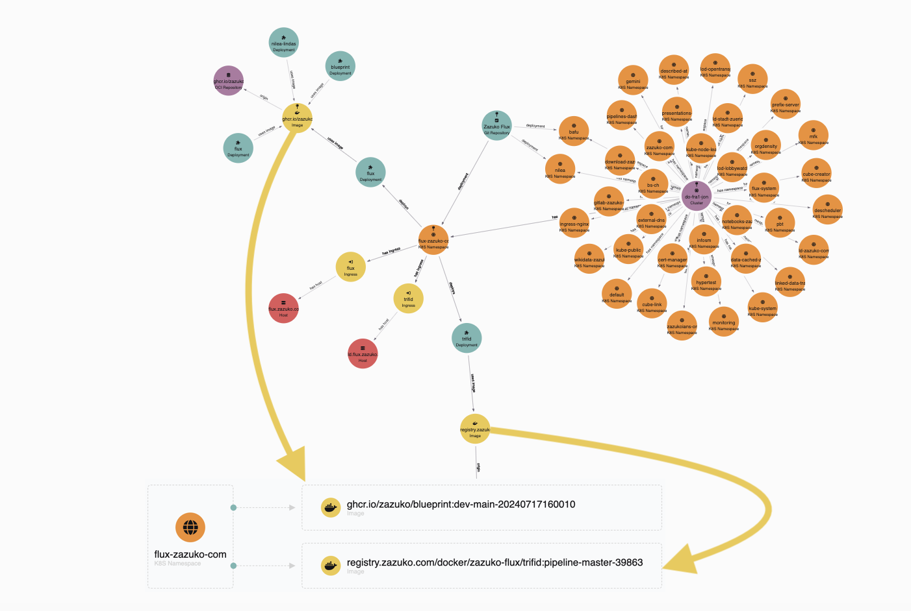
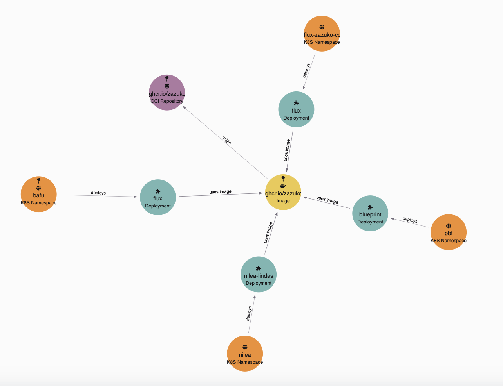

# Aggregates 

Here is the Idea behind it. Sometimes we have Things in our Graph that are Parts of a bigger Thing. For example a Database has Tables, a Table has Columns. There is no Column without a Table and there is no Table without a Database. The Database "consists" of Tables and the Table "consists" of Columns.

Another Example is a Namespace that "consists" of Deployments, StatefulSets and Hosts. The Pictures below show the Graphs of an Example Namespace. 

Sometimes we are interested in all these tiny elements in the Graph. But when it becomes big the Graph becomes unreadable. Especially when you are not an expert in the Domain. To illustrate this, here is the Graph of the same Namespace but with its neighbors.

Only one who is an expert in the Domain can really understand this Graph. The problem is that an expert knows the boundaries of higher level concepts. But a non-expert does not. Here is the same graph with the "Namespace Boundary" highlighted.

What if we add this "Boundary" information to the Graph? Then we can make it explicit what belongs to a Namespace and what does not. Furthermore we can hide the details of the Namespace and only show the Boundary. We can define "connection" Points where we can connect to a Namespace. The blue ellipses in the Picture below are the "connection" Points.

If we add this information to the Graph we are able to decide if we look "into" the Namespace or "at" the Namespace. We can "hide" the internals of the Namespace and only show the Boundary. Here is a possible view where we look "at" the Namespace. It's an outside view.

What is this outside view? I will show you.

The namespace is "Aggregated". You see just namespace and not the internals. 

The next thing are the connection Points. These are point we can connect to the Namespace. In our example it the Deployment.

The last thing are the neighbors connected to the namespace. In our example these neighbors are the Images.

This is the Idea behind Aggregates. We can define a Boundary and hide the internals. We can define connection Points and show the neighbors. We can define a view where we look "at" the Aggregate and not "into" the Aggregate.

Here is the View from the image to the Namespace. The Image is connected to Namespaces. We can directly see where is this Image used.

Which is the same as the following Graph but much more readable.

