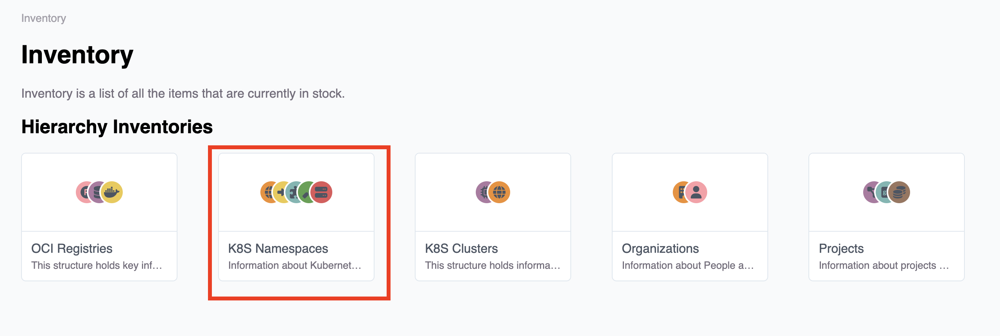
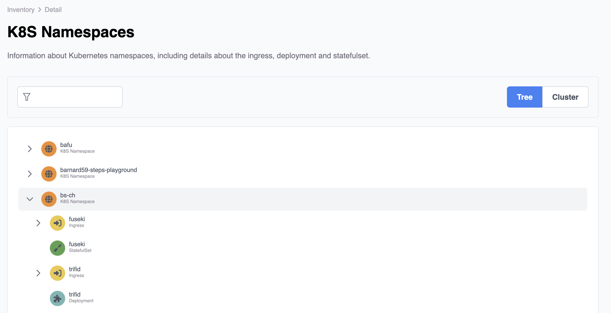
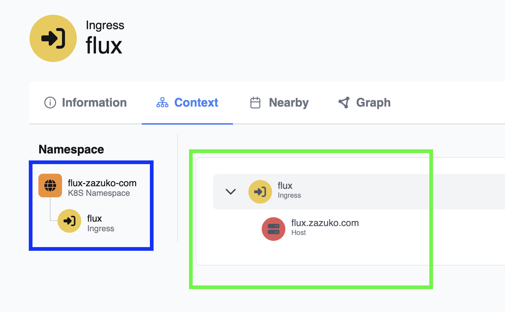
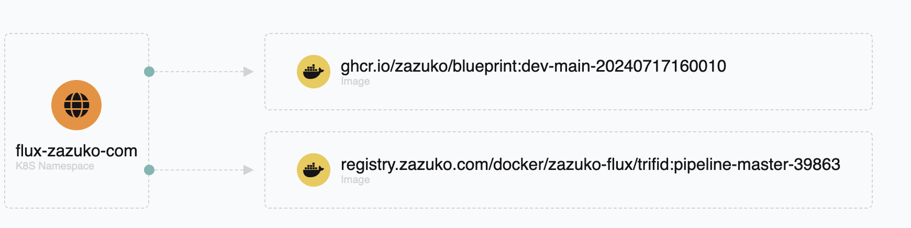
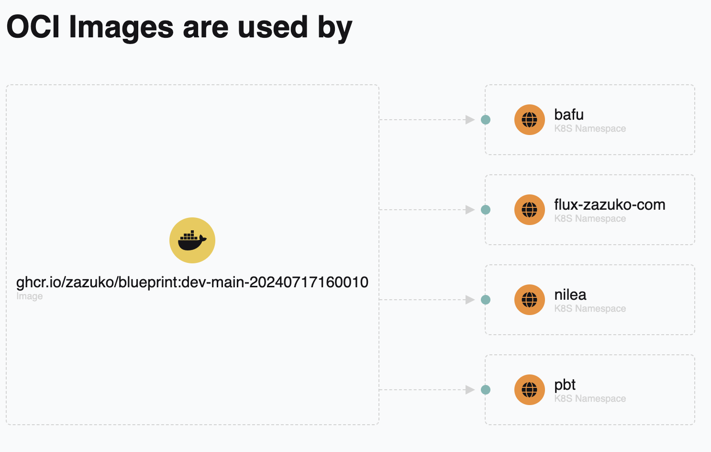

# Configure the Aggregation / Composition / Container

There are two kind of Aggregates. The first is the "Composition". The second is the "Container". The Composition is a collection of things that compose a higher level thing. The Container is a collection of things that are contained in another thing but it is not composed by them.

Containers are not as strong as Compositions. Use Compositions for a start.


```turtle
bp:Aggregate a rdfs:Class ;
    rdfs:label "Aggregate" ;
    rdfs:comment "An aggregate is a collection of things, such as a list of items, a set of items, or a group of items." ;
.

bp:Composition a rdfs:Class ;
    rdfs:subClassOf bp:Aggregate ;
    rdfs:label "Composition" ;
    rdfs:comment "A composition is a collection of things, that compose a higher level thing." ;
.

bp:Container a rdfs:Class ;
    rdfs:subClassOf bp:Aggregate ;
    rdfs:label "Container" ;
    rdfs:comment "A container is a collection of things, that are contained in a another thing but it is not composed by them." ;
.
```


## Tree
Here we configure a Namespace to be an Aggregate. We define the Boundary and the Connection Points.

First we define the internals of a Namespace. We define a Tree Structure with the following levels:

- Namespace
  - Ingress
    - Host
  - Deployment
  - StatefulSet

The Namespace is the Root of the Tree. The Ingress and Deployment are the first level of the Tree. The Host is a child of the Ingress. The Deployment and StatefulSet are children of the Namespace.

Technically we define a SHACL Shape for each level of the Tree. You can see it as a "chained" SHACL shapes. 

```turtle
PREFIX sh: <http://www.w3.org/ns/shacl#>
PREFIX rdf: <http://www.w3.org/1999/02/22-rdf-syntax-ns#>
PREFIX rdfs: <http://www.w3.org/2000/01/rdf-schema#>
PREFIX bp: <https://flux.described.at/>
PREFIX data: <https://ld.flux.zazuko.com/blueprint/app/>
PREFIX oci: <https://oci.described.at/>
PREFIX k8s: <https://k8s.described.at/>


## k8s namespace hierarchy
# Root - Namespace
data:K8SNamespaceHierarchyShape a sh:NodeShape ;
    rdfs:label "K8S Namespace Hierarchy";     # Just a label shown in the UI
    sh:targetClass k8s:Namespace;             # The target class of the Shape - Namespace in our case 
    sh:group data:K8SNamespaceTree ;          # The group of the Shape - the Tree
    sh:property [
        sh:name "Origin";                            # A label show in the UI
        sh:path [ sh:inversePath k8s:namespace ] ;   # the path to follow - no lists here, just a single path or single inverse path
        sh:node data:K8SIngressHierarchyShape;       # the next (level) shape in the hierarchy - Ingress 
    ] ,
    [
       sh:name "Origin";                             # A label show in the UI
       sh:path [ sh:inversePath k8s:namespace ] ;    # the path to follow - no lists here, just a single path or single inverse path
       sh:node data:K8SDeploymentHierarchyShape;     # the next (level) shape in the hierarchy - Deployment
    ],
    [
       sh:name "Origin";                            # A label show in the UI
       sh:path [ sh:inversePath k8s:namespace ] ;   # the path to follow - no lists here, just a single path or single inverse path
       sh:node data:K8SStatefulSetHierarchyShape;   # the next (level) shape in the hierarchy - StatefulSet
    ]
.

# level 1 - Ingress
data:K8SIngressHierarchyShape a sh:NodeShape ;
    rdfs:label "Namespace";
    sh:targetClass k8s:Ingress;
    sh:group data:K8SNamespaceTree ;
    sh:property [
        sh:path k8s:host ;
        sh:node data:K8SIngressHostHierarchyShape ;
    ] ;
.

# level 2 - Ingress - Host
data:K8SIngressHostHierarchyShape a sh:NodeShape ;
    rdfs:label "Ingress";
    sh:targetClass k8s:Host;
    sh:group data:K8SNamespaceTree ;
   .

# level 1 - Deployment
data:K8SDeploymentHierarchyShape a sh:NodeShape, bp:ConnectionPoint;          # this is a connection point - here we accept links .... later down in this document
    rdfs:label "Namespace";
    sh:targetClass k8s:Deployment;
    sh:group data:K8SNamespaceTree ;
.

# level 1 - StatefulSet
data:K8SStatefulSetHierarchyShape a sh:NodeShape, bp:ConnectionPoint;         # this is a connection point - here we accept links .... later down in this document
    rdfs:label "Namespace";
    sh:targetClass k8s:StatefulSet;
    sh:group data:K8SNamespaceTree ;
.

# All nodes of this tree are part of the same group
# This is used to reference the whole tree and add metadata to it
data:K8SNamespaceTree a sh:Group, bp:Hierarchy, bp:Composition;                 # As you can see this is a Group, a Hierarchy and a Composition - Composition means it is composed of these things defined in the tree
    rdfs:label "K8S Namespaces" ;                # The name of this tree
    rdfs:comment "Information about Kubernetes namespaces, including details about the ingress, deployment and statefulset." ; # a description of the tree
    bp:hasRoot data:K8SNamespaceHierarchyShape;  # define the tree root shape
.

```

With a configuration like this Blueprint knows a lot more about your Namespace. It has some effects in the UI. 

**Inventory**

You see it in the Inventory.



And you can search it or you can have a look at the contents of the Namespace. In many cases it's more to use this and not the "Search". Because you have more context.



**Explore**
Blueprint shows the information about trees in the Explore View in two ways. 



In the example are exploring the Ingress. In the blue Box you see the tree "upwards". It means this Ingress is part of a Namespace. In the green Box you see the tree "downwards". It means this Ingress has a Host. It is all based on the same Tree configuration.


# Links between Aggregates

## Aggregate to Node links 
Now we have defined an Aggregates. Lets say we have defined our Namespace tree as a composition. We can now look "into" the Namespace. But we can also look "at" the Namespace. That means we define links to a Namespace (as the composed one - basically a link to the namespace tree).

Here we go. We define a link between a Namespace and an OCI Image. The link is a CompositionToNodeLink. It means the Namespace is the composed one and the OCI Image is the Node.

```turtle
PREFIX sh: <http://www.w3.org/ns/shacl#>
PREFIX rdf: <http://www.w3.org/1999/02/22-rdf-syntax-ns#>
PREFIX rdfs: <http://www.w3.org/2000/01/rdf-schema#>
PREFIX bp: <https://flux.described.at/>
PREFIX data: <https://ld.flux.zazuko.com/blueprint/app/>
PREFIX oci: <https://oci.described.at/>
PREFIX k8s: <https://k8s.described.at/>


data:K8SNamespaceTreeToOciTreeLink a bp:CompositionToNodeLink ;
    sh:targetClass data:K8SNamespaceTree ;           # the target class is the targetClass of the SHACL Shape - but the source of our link
    bp:target oci:Image ;                            # this is the target of our link - the OCI Image
    rdfs:label "Depends on OCI Images" ;             # a label we can show in the UI
    bp:inverseLabel "OCI Images are used by" ;       # if we see the link in the opposite direction we show this label
    # there a two links between a Namespace and an OCI Image
    # the "connection" points are the Deployment and the StatefulSet
    # here we define the path from a "connection" point to the OCI Image
    sh:property [                                   
        sh:targetClass k8s:Deployment ;             # the source of the link (connection point Deployment)
        sh:path k8s:image ;                         # the path to follow to reach the target node (the OCI Image)
        sh:class oci:Image ;                        # the target class of the instance on the other side of the link
    ];
     sh:property [
        sh:targetClass k8s:StatefulSet ;            # the source of the link (connection point StatefulSet)
        sh:path k8s:image ;                         # the path to follow to reach the target node (the OCI Image)
        sh:class oci:Image ;                        # the target class of the instance on the other side of the link
    ]
.
```

This leas to the following UI.

or this in the opposite direction



